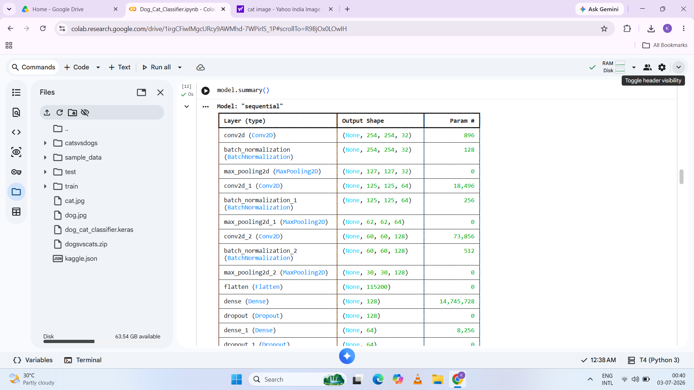

# Dog-Cat-Image-Classifier

# Dog-Cat Image Classifier using CNN

A deep learning project that classifies images as **Dog** or **Cat** using a Convolutional Neural Network (CNN) built with TensorFlow and Keras.

---

## 📌 Project Overview

This project implements a CNN model to perform binary image classification. The model is trained on the Kaggle **Dogs vs Cats** dataset and can accurately predict whether a given image belongs to a dog or a cat.

---

## 🚀 Features

- Binary image classification (Dog vs Cat)
- CNN model built using TensorFlow & Keras
- Image preprocessing and normalization
- Prediction on custom images
- Training and validation performance visualization
- Easy to run in Google Colab

---

## 🛠️ Tech Stack

- Python
- TensorFlow
- Keras
- OpenCV
- NumPy
- Matplotlib
- Google Colab

---

## 📂 Dataset

- **Source:** Kaggle - Dogs vs Cats Dataset
- **Total Images:** 25,000
- **Training Images:** 20,000
- **Validation Images:** 5,000
- **Classes:** Dog, Cat
- **Image Size:** 256 × 256 pixels

---

## 🧠 Model Architecture

The CNN model includes:

- Convolutional Layers
- Batch Normalization
- Max Pooling Layers
- Flatten Layer
- Dense Layers
- Dropout Layers
- Sigmoid Activation Function

---

## 📊 Results

| Metric | Value |
|--------|-------|
| Training Accuracy | **95.37%** |
| Validation Accuracy | **75.84%** |

The model successfully predicts unseen dog and cat images after preprocessing.

---

## 📸 Project Screenshots

### Model Summary

### CNN Model

### Accuracy Graph

### Loss Graph

### Dog Prediction

### Cat Prediction

---
**Kajal Singh**

GitHub: https://github.com/kajallsingh
